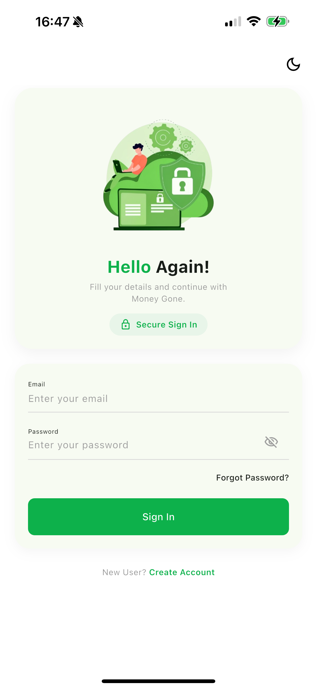
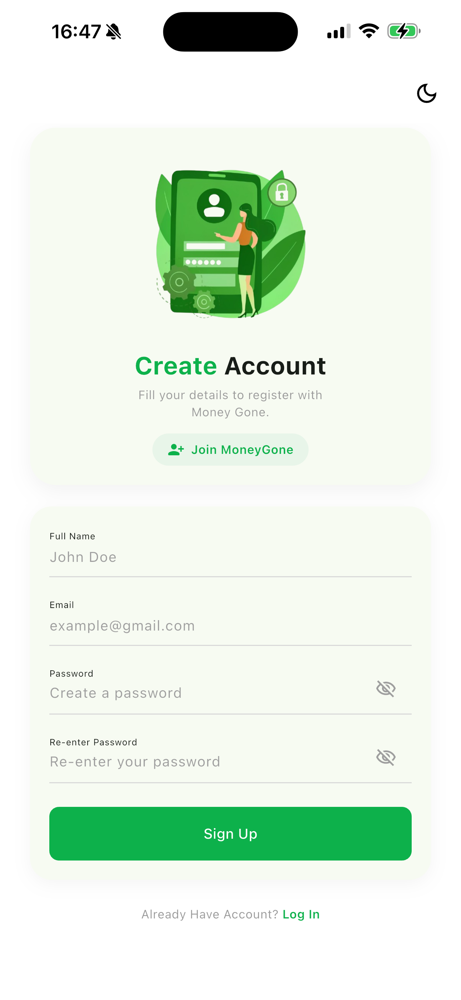
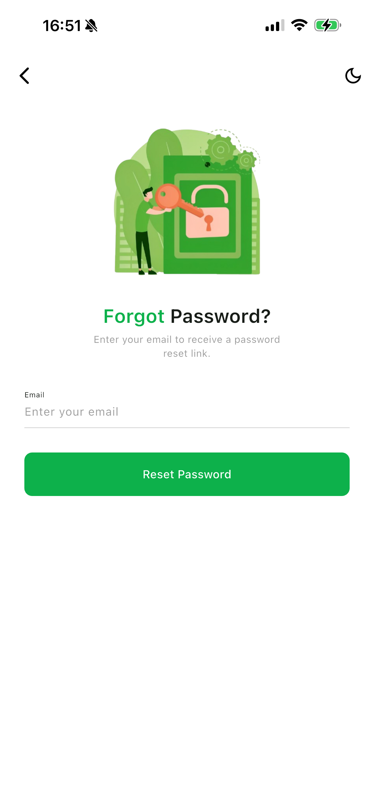
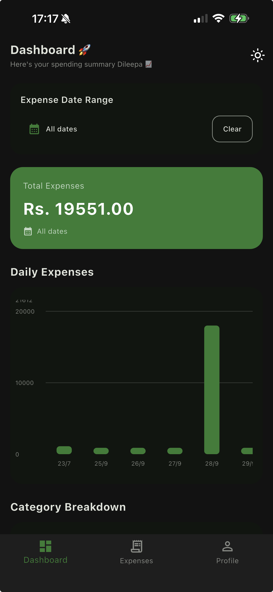
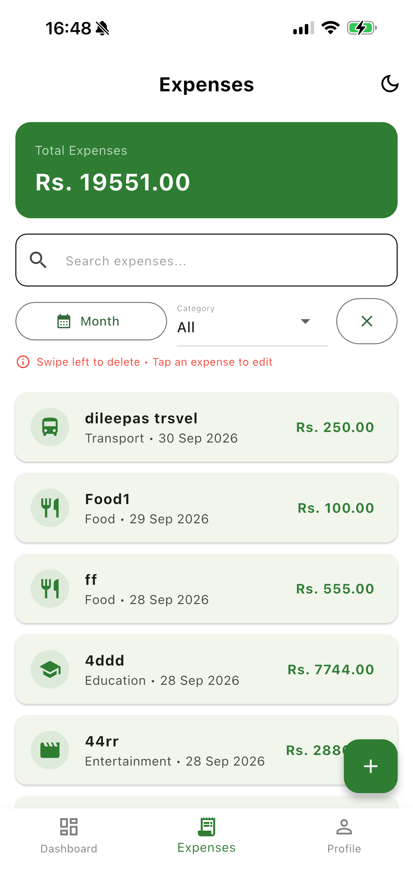
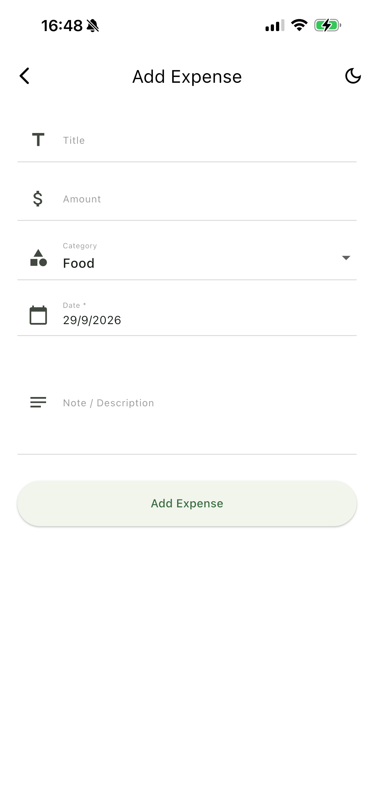
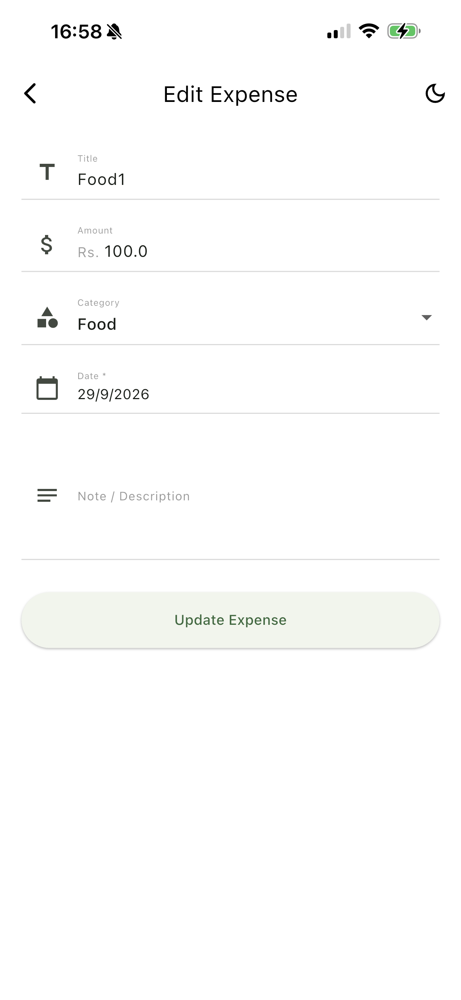
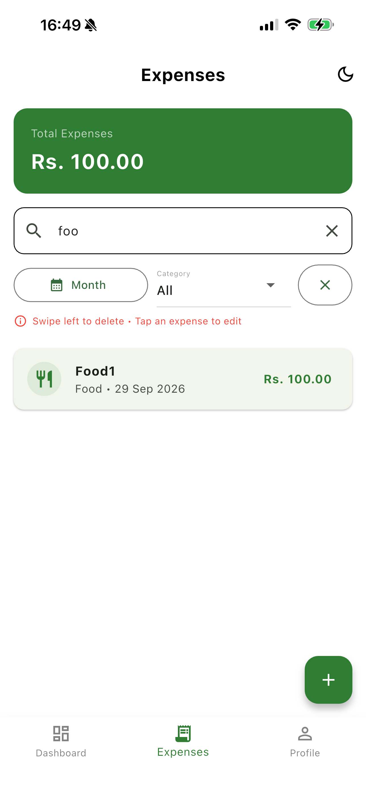
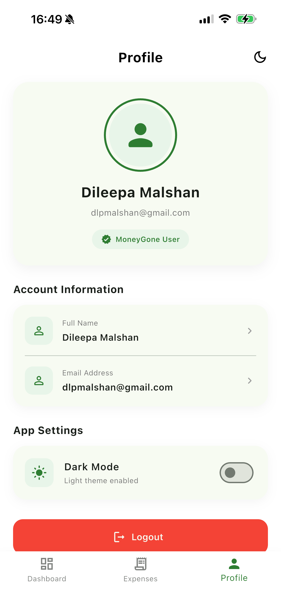
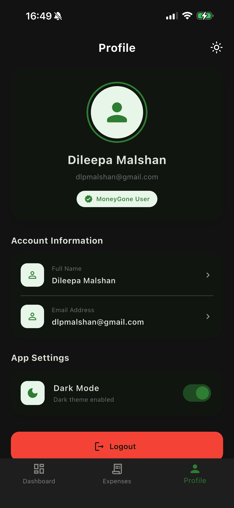

# 💰 MoneyGone

A clean and user-friendly **Flutter Expense Tracker** application built with **Firebase**.

MoneyGone helps users manage their daily expenses, track spending, view summaries, and understand their spending habits through simple charts and filters.

## 📱 Screenshots

### 🔐 Authentication

| Login                           | Sign Up                            | Forgot Password                                     |
| ------------------------------- | ---------------------------------- | --------------------------------------------------- |
|  |  |  |

### 📊 Dashboard



### 💳 Expense Management

| Expenses                              | Add Expense                                 | Edit Expense                                  |
| ------------------------------------- | ------------------------------------------- | --------------------------------------------- |
|  |  |  |

### 🔎 Search & Filters



### 👤 Profile & Dark Mode

| Profile                             | Dark Mode                               |
| ----------------------------------- | --------------------------------------- |
|  |  |

---

## ✨ Features

### 🔐 Authentication

* User registration
* Login and logout
* Forgot password
* Firebase Authentication

### 💰 Expense Management

* Add expenses
* Edit expenses
* Delete expenses
* View expense history
* Expense categories
* Optional notes

### 📊 Dashboard

* Monthly spending total
* Spending summary
* Category-based spending
* Spending charts

### 🔎 Search & Filters

* Search expenses
* Filter by category
* Filter by date
* Clear filters
* Pull-to-refresh

### 🎨 User Experience

* Light and dark mode
* Clean and responsive UI
* Form validation
* Loading states
* Empty states
* Error handling
* Bottom navigation

---

## 🛠️ Technologies

* **Flutter & Dart**
* **Firebase Authentication**
* **Cloud Firestore**
* **GetX**
* **fl_chart**
* **intl**

---

## 🚀 Getting Started

### Prerequisites

Make sure you have installed:

* Flutter
* Dart
* Android Studio
* Android SDK
* Firebase CLI
* FlutterFire CLI

Check your Flutter setup:

```bash
flutter doctor
```

### 1. Clone the repository

```bash
git clone https://github.com/dileepa-dev/MoneyGone.git
cd MoneyGone
```

### 2. Install dependencies

```bash
flutter pub get
```

### 3. Configure Firebase

Create a Firebase project and enable:

* Firebase Authentication → Email/Password
* Cloud Firestore

Then configure Firebase:

```bash
firebase login
flutterfire configure
```

### 4. Run the application

```bash
flutter run
```

---

## 📦 Build APK

To create a release APK:

```bash
flutter build apk --release
```

The APK will be available in:

```text
build/app/outputs/flutter-apk/
```

For a Google Play App Bundle:

```bash
flutter build appbundle --release
```

---

## 📁 Project Structure

```text
lib/
├── app/
├── controllers/
├── model/
├── screens/
├── widgets/
├── firebase_options.dart
└── main.dart
```

---

## 🤖 AI Tools Used

AI tools were used as development assistants during the creation of MoneyGone.

* **ChatGPT** – Used for development guidance, debugging, code suggestions, UI improvements, Firebase setup assistance, and resolving Flutter errors.
* **GitHub Copilot** – Used for code completion and suggestions during development.

AI tools were used to support the development process, while the application functionality, integration, testing, and final implementation were reviewed and completed as part of the project development.

---

## 🎨 Design Resources

Some visual assets used in the application and README screenshots were sourced from **Freepik**.

* **Freepik** – Used as a source for selected design/visual assets.

The application UI and implementation were developed specifically for the MoneyGone project.

---

## 👨‍💻 Developer

**Dileepa Malshan**

Software Engineering Undergraduate
Sri Lanka

---

## 📄 License

This project was developed for educational and portfolio purposes.
